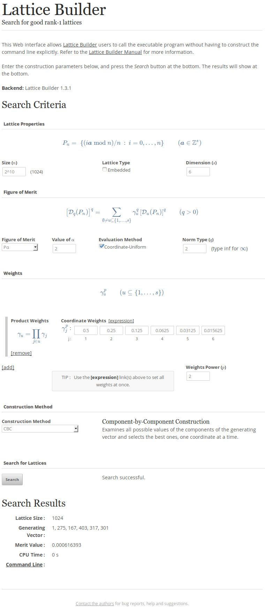

# Lattice Builder
_A general software tool for constructing rank-1 lattice rules_

*Lattice rules* are often used as a replacement for [Monte
Carlo](http://en.wikipedia.org/wiki/Monte_Carlo_integration) to integrate
multidimensional functions.
For certain problems, well-constructed lattice rules can dramatically reduce the integration error with respect to Monte Carlo.

Lattice Builder is a software tool and library that implements a variety of
construction algorithms for good rank-1 lattice rules.
It supports exhaustive and random searches, as well as component-by-component
(CBC) and random CBC constructions, for any number of points, and for various
measures of (non)uniformity of the points.
The implemented measures include the weighted Pα square discrepancy,
the Rα criterion, and figures of merit based on the spectral test,
with projection-dependent weights.
For numbers of points that are integer powers of a prime base, the construction
of embedded rank-1 lattice rules is supported through any of the above
algorithms, and also through a fast CBC algorithm, with a variety of
possibilities for the normalization of the merit values of individual embedded
levels and for their combination into a single merit value.

Details about lattice rules and Lattice Builder can be found in
[*Lattice Builder*: A General Software Tool for Constructing Rank-1 Latice Rules](http://www.iro.umontreal.ca/~lecuyer/myftp/papers/latbuilder.pdf).

## Quick Start Guide

The quickest way to get started Lattice Builder is to [download a binary
distribution](http://simul.iro.umontreal.ca/latbuilder/bin)
pre-compiled for your platform.
Then, **simply unpack the archive; no further installation is required**.
The executable programs — the Lattice Builder command-line and web interfaces — can be found in the `latbuilder/bin` subdirectory.

You can then use the [Lattice Builder Web
Interface](http://simul.iro.umontreal.ca/latbuilder/doc/d8/d2d/webif.html)
by installing [Python 2.7](http://python.org/download/) and executing the script

	latbuilder/bin/LatBuilderWeb.py

extracted from the binary package.

Or, you can read the [Lattice Builder Command Line Tutorial](http://simul.iro.umontreal.ca/latbuilder/doc/d5/d56/cmdtut.html) to teach yourself how to use the executable program extracted from the binary package at

	latbuilder/bin/latbuilder

for Linux distributions, or at

	latbuilder/bin/latbuilder.exe

for Windows distributions.

The structure of the binary packages is described in more detail in the
[Downloading Binaries](#downloading-binaries) section.

You can also choose to
[compile Lattice Builder from the source code](http://simul.iro.umontreal.ca/latbuilder/doc/d2/df6/building.html).

## Downloading Binaries

The easiest way to start using Lattice Builder is to [download a binary
distribution](http://simul.iro.umontreal.ca/latbuilder/bin/) of Lattice
Builder, that includes the executable `latbuilder` program, together with
the Lattice Builder library and documentation.

The binary distribution packages have the following directory structure:

* **bin**: contains the executable `labuilder` program;
* **include**: contains the C++ header files necessary to use the Lattice
  Builder library;
* **lib**: contains the binary Lattice Builder library;
* **share/doc/latbuilder/html**: contains the HTML documentation;
* **share/doc/latbuilder/examples**: contains examples on using the Lattice
  Builder library;

The binary packages do not include an installation program.  To use the Lattice
Builder program, simply unpack the binary distribution package and move to its
root directory, then, e.g., to construct, component-by-component, a rank-1
lattice rule with 8191 points in 5 dimensions using the P-alpha criterion with
alpha=2 and with uniform product weights with value 0.1, issue the following
command on Linux:

	bin/latbuilder -l ordinary -n 8191 -d 5 -m CS:P2 -w product:0.1 -c CBC

or, on Window systems:

	bin\latbuilder -l ordinary -n 8191 -d 5 -m CS:P2 -w product:0.1 -c CBC

Try `bin/latbuilder --help` or read **share/doc/latbuilder/html/cmdtut.html**
for more information on using the Lattice Builder program.

## Compiling Lattice Builder

[Instructions to compile Lattice Builder](http://simul.iro.umontreal.ca/latbuilder/doc/d2/df6/building.html)
are part of the [Lattice Builder manual](http://simul.iro.umontreal.ca/latbuilder/doc/).

## Using the Lattice Builder Program

If the installation suceeded, the following command should output the installed 
version of Lattice Builder:

	<dist-prefix>/bin/latbuilder --version

Help on usage can also be obtained by using the `--help` switch.

## Using the Lattice Builder Web Interface

The Lattice Builder Web Interface is included in the binary packages.
[Python 2.7](http://python.org/download/) must be installed on the host machine.
The local web server can be started by launching the following Python script:

	<dist-prefix>/bin/LatBuilderWeb.py

The web interface can then be used by connecting a browser to the
[http://localhost:8080](http://localhost:8080/LatBuilderWeb.html).

## Using the Lattice Builder Library

An example Jamfile and an example Makefile that can be modified to build a
project that uses the Lattice Builder application programming interface (API)
can be found under the `<dist-prefix>/share/doc/examples/myproject` directory,
together with a very simple piece of code.

For more information and a tutorial, refer to the HTML documentation in the
`<dist-prefix>/share/doc/html` directory.

## Frequently Asked Questions

### What construction type should I use to find good high-dimensional lattices in reasonable time?

Fast CBC with a coordinate-symmetric figure of merit.

For example, the following command line performs a fast CBC construction using
the weighted P-alpha criterion with alpha=2 and with product weights giving
the same weight of 0.01 to every coordinate (this means a weight of 1e-2
for projections of order 1, of 1e-4 for projections of order 2, of 1e-6 for
projections of order 3, etc.):

	latbuilder -l ordinary -n 2^16 -d 100 -m CS:P2 -c fast-CBC -w product:0.01

The above search is for n=2^16=65,536 points in dimension 100.  Lattice Builder
does that very quickly.

